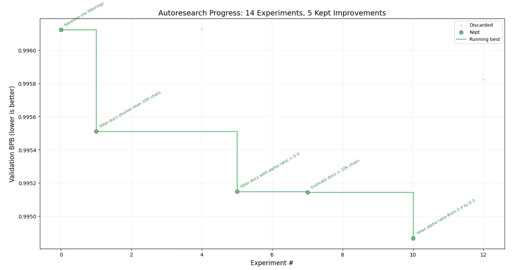

# autodata



A fork of [karpathy/autoresearch](https://github.com/karpathy/autoresearch) that flips the experiment: instead of letting an AI agent optimize the **model architecture**, the agent optimizes the **data pipeline**. The model, tokenizer, and evaluation are frozen — the only variable is what data the model sees and how it's arranged.

The hypothesis: maybe smarter data curation matters more than a better architecture.

## How it works

Give an AI agent the repo, point it at `program.md`, and let it run autonomously. It modifies the data pipeline, trains for 5 minutes, checks if val_bpb improved, keeps or discards, and repeats. You wake up to a log of data experiments and (hopefully) a better model — trained on the same architecture, just fed better data.

The repo has six files that matter:

- **`data.py`** — the data pipeline the agent edits. Document filtering, preprocessing, mixing, curriculum ordering, packing — anything that changes what the model sees. **This file is edited and iterated on by the agent.**
- **`explore.py`** — throwaway data exploration scripts. The agent writes these to analyze data on Modal (`modal run modal_app.py --explore-script explore.py`). **Written by the agent as needed.**
- **`program.md`** — instructions for the agent. **This file is edited and iterated on by the human.**
- **`modal_app.py`** — Modal integration: sends `data.py` to a remote GPU, runs training, returns metrics. Also runs exploration scripts on remote CPU. **Set up once.**
- **`prepare.py`** — fixed infrastructure: downloads training data, trains a BPE tokenizer, provides evaluation metric and base data utilities. **Read-only.**
- **`train.py`** — fixed model: GPT architecture, Muon + AdamW optimizer, training loop. **Read-only.**

Training runs for a **fixed 5-minute time budget** (wall clock, excluding startup/compilation). The metric is **val_bpb** (validation bits per byte) — lower is better.

## Quick start (Modal — no local GPU needed)

Training runs on [Modal](https://modal.com) so you don't need a local GPU. The raw data lives on a Modal Volume; only `data.py` (~KB) is sent up each run, and only metrics come back.

**Requirements:** Python 3.10+, a Modal account.

```bash
# 1. Create a virtual environment and install dependencies
python -m venv .venv
source .venv/bin/activate

# 2. Install Modal CLI
pip install modal
modal setup  # one-time auth

# 3. Download data and train tokenizer on Modal (one-time)
modal run modal_app.py --prepare

# 4. Run a single training experiment (~5 min on a remote H100)
modal run modal_app.py
```

### Quick start (local GPU)

If you have an NVIDIA GPU locally, you can skip Modal entirely:

```bash
curl -LsSf https://astral.sh/uv/install.sh | sh
uv sync
uv run prepare.py
uv run train.py
```

## Running the agent

Spin up Claude Code, Codex, or whatever agent you prefer in this repo (disable all permissions), then prompt something like:

```
Have a look at program.md and let's kick off a new experiment! Let's do the setup first.
```

The `program.md` file is essentially a lightweight "skill" that tells the agent how to run the experiment loop.

## Project structure

```
prepare.py      — constants, data prep + runtime utilities (do not modify)
train.py        — model, optimizer, training loop (do not modify)
data.py         — data pipeline (agent modifies this)
explore.py      — data exploration scripts (agent writes these, run on Modal)
modal_app.py    — Modal integration (sends data.py to remote GPU, explore.py to remote CPU)
program.md      — agent instructions
pyproject.toml  — dependencies
```

## Design choices

- **Data, not architecture.** The original autoresearch lets the agent modify the model. This fork freezes the model and lets the agent modify the data pipeline instead. Same hill-climbing loop, different variable.
- **Frozen tokenizer.** The tokenizer is trained once and never changes. This is critical: cross-entropy loss is calculated per-token against a specific vocabulary. If the tokenizer changed between experiments, val_bpb scores would be incomparable — the agent wouldn't know if a data change actually helped or if the tokenizer just warped the metric.
- **Fixed time budget.** Training always runs for exactly 5 minutes. This means ~12 experiments/hour, ~100 overnight. Experiments are directly comparable regardless of what the agent changes in the data pipeline.
- **Self-contained.** No external dependencies beyond PyTorch and a few small packages. One GPU, one file, one metric.

## Platform support

Training requires an NVIDIA GPU. With Modal (default), you don't need one locally — Modal provides remote H100s on demand. For local training, see the original [autoresearch](https://github.com/karpathy/autoresearch) repo and its forks for MacOS/Windows/smaller GPU support.

## Credits

Based on [karpathy/autoresearch](https://github.com/karpathy/autoresearch), which is a simplified single-GPU implementation of [nanochat](https://github.com/karpathy/nanochat).

## License

MIT
